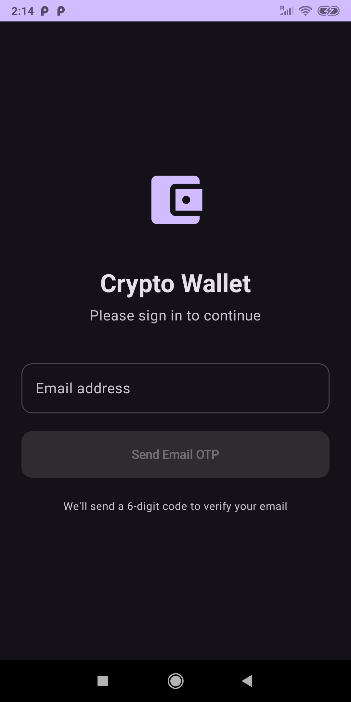
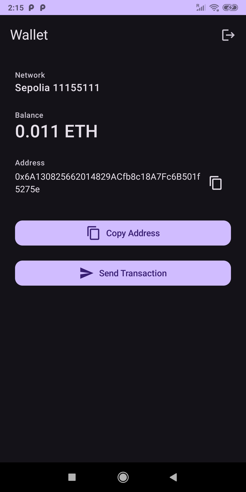
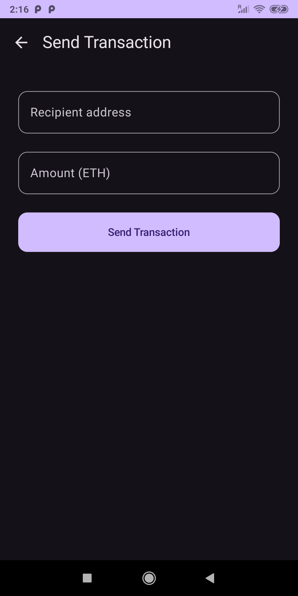

# Crypto Wallet Android App

A simple Android application with Web3 authentication and crypto wallet functionality using Dynamic SDK. Built for the Crypto Wallet Test Assignment.

## Overview

This app demonstrates basic blockchain operations on **Ethereum Sepolia** testnet:
- Email OTP authentication via Dynamic SDK
- View wallet address and balance (ETH)
- Send transactions on Sepolia

---

## Architecture

### Tech Stack

| Layer | Technology |
|-------|------------|
| **UI** | Jetpack Compose, Material Design 3 |
| **Architecture** | MVVM (Model-View-ViewModel) |
| **State** | Kotlin Coroutines, StateFlow |
| **DI** | Hilt |
| **Auth** | Dynamic SDK (Email OTP) |
| **Blockchain** | Dynamic SDK EVM APIs, Web3j for Sepolia balance |

### Structure

```
app/src/main/java/com/example/myapplication2/
├── common/
│   ├── AppModule.kt          # Hilt DI module
│   └── AppNavigation.kt      # Compose navigation graph
├── login/
│   ├── LoginScreen.kt        # Login UI + OTP bottom sheet
│   └── LoginViewModel.kt     # Auth state, OTP send/verify
├── wallet/
│   ├── WalletDetailsScreen.kt
│   ├── WalletDetailsViewModel.kt
│   ├── SendTransactionScreen.kt
│   ├── SendTransactionViewModel.kt
│   └── SepoliaRepository.kt  # Balance fetch via Web3j + Sepolia RPC
├── ui/theme/                 # Compose theme
├── MainActivity.kt
└── CryptoWalletApplication.kt
```

### Flow

1. **Login** → User enters email → OTP sent → Verify code → Authenticated
2. **Wallet** → Embedded EVM wallet created by Dynamic → Address & balance loaded from Sepolia RPC
3. **Send** → Enter recipient + amount → Dynamic SDK signs & broadcasts on Sepolia

---

## How to Run

### Prerequisites

- **Android Studio** (Arctic Fox or newer, or latest)
- **JDK 17**
- **Android device or emulator** (API 28+)

### Steps

1. **Clone the repository**
   ```bash
   git clone https://github.com/YOUR_USERNAME/MyApplication2.git
   cd MyApplication2
   ```

2. **Open in Android Studio**
   - File → Open → select the project folder
   - Wait for Gradle sync to finish

3. **Configure Dynamic (if using your own project)**
   - Create a project at [app.dynamic.xyz](https://app.dynamic.xyz)
   - Copy your `environmentId`
   - Update `MainActivity.kt`:
     ```kotlin
     environmentId = "YOUR_ENVIRONMENT_ID"
     ```
   - Enable **Sepolia** network in the Dynamic dashboard

4. **Build and run**
   - Connect a device or start an emulator
   - Run → Run 'app' (or `./gradlew installDebug`)

### Get Sepolia Test ETH

- [Google Cloud Faucet](https://cloud.google.com/application/web3/faucet/ethereum/sepolia)
- [Alchemy Faucet](https://www.alchemy.com/faucets/ethereum-sepolia)

Check balance: https://sepolia.etherscan.io/address/YOUR_ADDRESS

---

## Screenshots

| Login | Wallet Details | Send Transaction |
|-------|----------------|------------------|
|  |  |  |

*Place screenshots in a `screenshots/` folder at the project root, named `login.png`, `wallet.png`, and `send.png`.*

---

## Assumptions

1. **Dynamic dashboard** – Sepolia network is enabled for the project. If balance or transactions fail, ensure Sepolia is configured in the Dynamic dashboard.
2. **Embedded wallet** – Dynamic creates an embedded EVM wallet on first login; the address is used for balance and send.
3. **RPC** – Public Sepolia RPC (`ethereum-sepolia-rpc.publicnode.com`) is used for balance. For production, use a dedicated RPC provider (Alchemy, Infura).
4. **Redirect URL** – `myapp://auth` is set in `ClientProps` and `AndroidManifest.xml`.
5. **Login per session** – OTP verification is required on each app launch; no persistent session across restarts.

---

## Dependencies

- Dynamic SDK (`dynamic-sdk-android.aar`)
- Web3j (Sepolia balance)
- Jetpack Compose, Material3
- Hilt
- Kotlin Coroutines

---

## License

Educational / test assignment use only.


